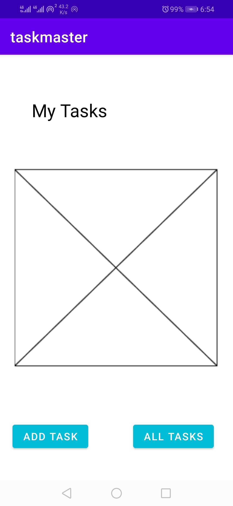
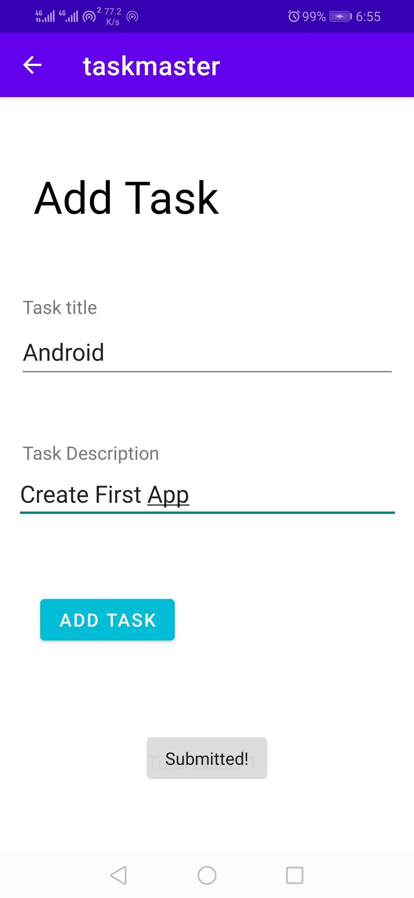
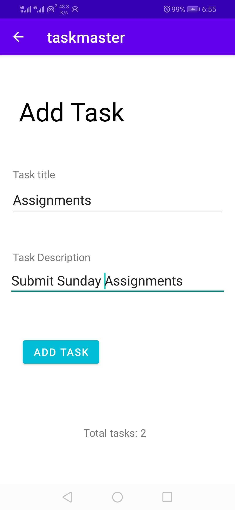
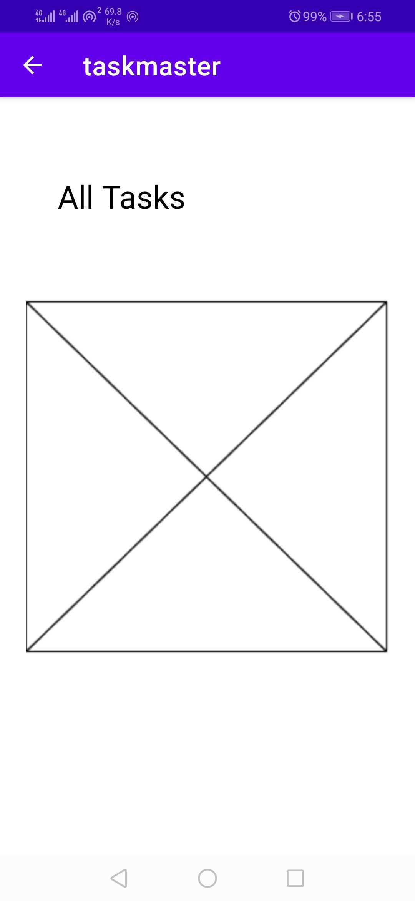
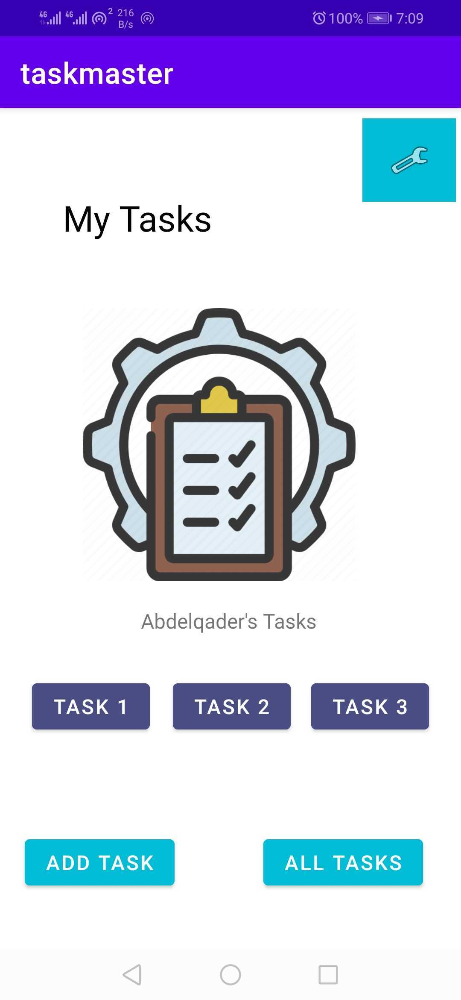
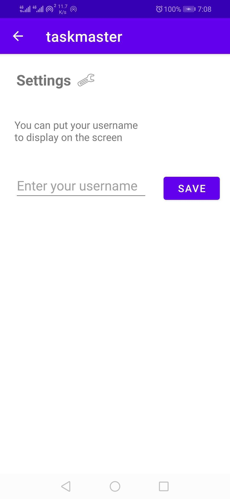
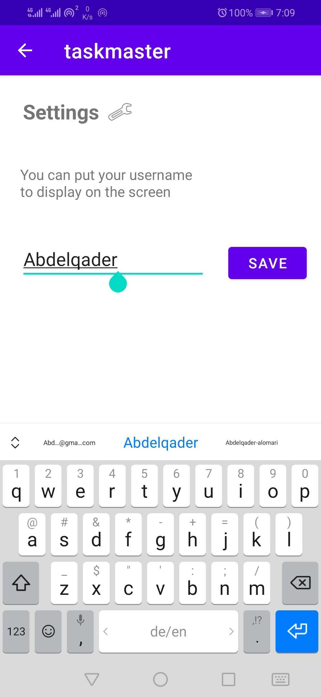
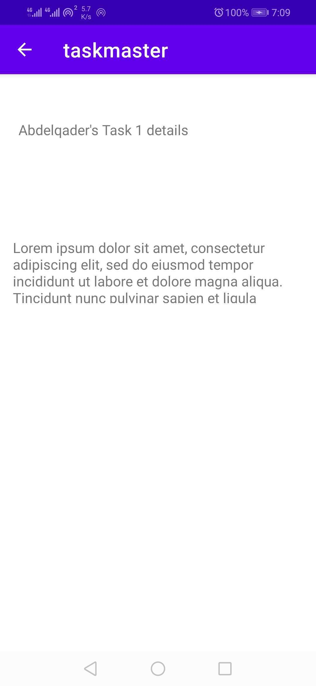

# Task Master

## Log v1.0 31/10/2021

Task master is an android app with is help people to manage their daily tasks

It's built with Java for android applications, so any android user can use the app.

## Day one - Lab 26

### Features:

3 Activities:

- Main Page: 
- Add Task Page: 
   to show counter
- All Tasks Page: 

## Day Two - Lab 27

Added the ability to send data among different activities in the application using SharedPreferences and Intents.

### Features:

- Main Page: 
- Settings Page: 
  
- Task Detail Page: in this lab there is Task1, Task2, and Task3
  
  
  

<!-- From previous lab -->

- Add Task Page: 
-  to show counter
- All Tasks Page: 
