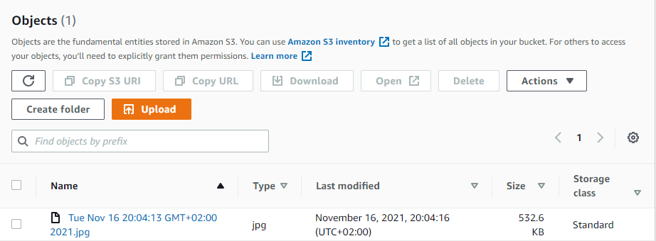

# Task Master

## Log v2.0 17/11/2021

Task master is an android app with is help people to manage their daily tasks

It's built with Java for android applications, so any android user can use the app.

## Day one - Lab 26

### Features:

3 Activities:

- Main Page: 
- Add Task Page: 
   to show counter
- All Tasks Page: 

## Day Two - Lab 27

Added the ability to send data among different activities in the application using SharedPreferences and Intents.

### Features:

- Main Page: 
- Settings Page: 
  
- Task Detail Page: in this lab there is Task1, Task2, and Task3
  
  
  

<!-- From previous lab -->

- Add Task Page: 
-  to show counter
- All Tasks Page: 

## Day Three - Lab 28

Added Fragment and layout and connect it to the main by recycle view and make a configuration for adapter.
So when user click on the task it will show the details.screenshots

- MainPage: 
- Android task: 
- Task2: 

## Day Four - Lab 29

- Set up Room application, and modify Task class to be an Entity.
- Modify Add Task form to save the data entered in as a Task in database.
- Refactor homepage’s RecyclerView to display all Task entities in database.

- MainPage after add 1 task:
  
- Add Task Page:
  
  Added Task:
  
- Main Page with 2 tasks added:
  

## Day Five - Lab 31

In this lab the core thing is test the app using Espresso Tests which is really nice and easy test come up with 2 versions
one can be write manually (coded) which is powerful and I did in this lab
and the other is visual as espresso recorded which record each action that do in app and can add asserts after that and make configurations and write codes automatically which is easier and quick, but not as powerful as regular espresso test.

In this lab I tested most features of app using Espresso test and wrote comment in each single line to make it very clear. Most Tests depend on buttons and texts and what appeared on screen.

## Day Six - Lab 32

In this lab it must pre Created AWS Account and installed Amplify CLI to set up the application with Amplify

- Using the `amplify add api` command, create a Task resource that replicates our existing Task schema.
- Update all references to the Task data to instead use AWS Amplify to access your data in DynamoDB instead of in Room.
- Modify Add Task form to save the data entered in as a Task to DynamoDB.
- Refactor homepage’s RecyclerView to display all Task entities in DynamoDB.

- Same images for previous lab:

- MainPage after add 1 task:
  
- Add Task Page:
  
  Added Task:
  
- Main Page with 2 tasks added:
  

## Day Six - Lab 33

In this lab we updated the schema by added Team Model and make one to many relationship

- So in this lab tasks added become related to the team.
- Also I delete unnecessary from previous labs and comment some of it
  And make some styling to look better.
  
- Images for this lab:

- MainPage after add 1 task:

- Setting page to add username and select the time (tasks will show only for selected team)
  
- HomePage before add tasks to SSD Coders team(selected one)
  
- Add Task Page:
  
- Main Page after added 3 tasks:
  

## Day Seven - Lab 36

### User Login
Add Cognito to your Amplify setup. Add in user login and sign up flows to your application, using Cognito’s pre-built UI as appropriate. 

The process -> Register page shown first (because the app is new and the most will be register first) to register by username, email and password
if entered valid values it will take the user to confirmation page to confirm the email by confirmation code sent to user's email,
after entered correct confirmation code user will redirect to login page where can enter his her data and start using the app.
if the user already registered he/she can click on the "already have an account ?" to take him/her to the login page

### User Logout
Allow users to log out of your application, it will redirect the user after that to login page.

### Screenshots

- Register Page:
  - 
- Confirmation Activity:
  -  
- Login Page:
  -  
- Main Page after Login:
  - 

## Day Seven - Lab 36

### User Login
Add Cognito to your Amplify setup. Add in user login and sign up flows to your application, using Cognito’s pre-built UI as appropriate.

The process -> Register page shown first (because the app is new and the most will be register first) to register by username, email and password
if entered valid values it will take the user to confirmation page to confirm the email by confirmation code sent to user's email,
after entered correct confirmation code user will redirect to login page where can enter his her data and start using the app.
if the user already registered he/she can click on the "already have an account ?" to take him/her to the login page

### User Logout
Allow users to log out of your application, it will redirect the user after that to login page.

### Screenshots

- Register Page:
  - 
- Confirmation Activity:
  -  
- Login Page:
  -  
- Main Page after Login:
  - 

## Lab 37

## Uploads
On the “Add a Task” activity, allow users to optionally select a file to attach to that task. If a user attaches a file to a task, that file should be uploaded to S3, and associated with that task.

## Displaying Files
On the Task detail activity, if there is a file that is an image associated with a particular Task, that image should be displayed within that activity. (If the file is any other type, you should display a link to it.)

### Screenshots

- Upload File:
  - 
- File Uploaded done AWS S3:
  -  
     
- Main Page
  - 

## Lab 38

### Notifications on Task Creation
When a new task is created within a team, alert all users who are a part of that team about that new task.

- Store which team a user is part of in the cloud
- Add a Lambda trigger on task creation
- Use SNS to send a notification as part of that Lambda

### Screenshots

- Image 1:
  - 
- Image 2:
  -  

- Image 3:
  - 

## Lab 39

Add Analytics to amplify project. Create and send an Event whenever launch intents that start new activities.

### Screenshots

- 
- 
- 